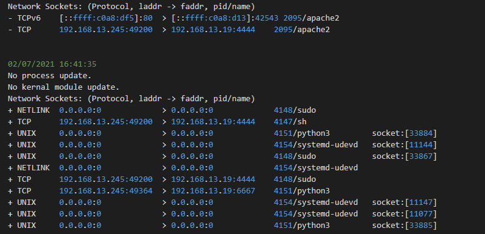

Vidya Sagar @sagabegins  
Mohamed Anis @AnisBoudj  

## Section 1: Implement a volatility3 plugin for network connections

A volitility plugin named **findsocket.py** was implemented to find the details of network connections on the machine being monitored. The connection information is collected from the `__sk_common` struct which is referenced inside `sk` struct that can be obtained by following the instructions in the project task document. Since `__sk_common` cannot be directly obtained by calling it normally any other member of an object, `__getattr__` function was used to get the object from the sk struct.  
There were some issues when trying to obtaining the file descriptors of some of the tasks. This issue was relsolved by using a utility function provided by volatility which obtains all the file discriptors of used by the process.  
More information about the plugin and dependency is listed under [code files](#code-files) section.

## Section 2: Malware detection using VMI with volatility
### a) Implement an analysis tool
We implemented a plugin **watcher.py** which yields processes and loaded kernel modules in real time.
It requires the **findsocket.py** from Section one, **lsmod** and  **pslist** plugins. 

- At time 0 :
The code creates 3 sets of : the network connections, running processes and kernel modules.
- At t seconds after first capture :
We get the running process and we check if they exist in the previous processes set, (same for kernel modules and network sockets)
We also used some helper functions to process the data and store it in lists.
- At every iteration the memory layer and primary layer are reloaded.

### b) Attack analysis

When the attack is initiated by `touch /attack/192.168.13.245`, the attack vm does the following:

<figure align = "center">
    
    <figcaption align = "center"><b>Fig.1 - Attack 1</b></figcaption>
</figure>


- Connects to the target vm's wordpress website. (As seen in Fig. 1)
- Probably logs in to the site as a root user, since the user name and password is generic it doesn't take long. (As seen in Fig. 1 unix connection of sql)

<figure align = "center">
    
    <figcaption align = "center"><b>Fig.2 - Attack 2</b></figcaption>
</figure>

- Then it resumes the connection to the target vm's wordpress site, after which it make the target vm connect to the attack vm's port 4444, which is usually used by metasploit. But could also be some other malware. (As seen in Fig 2.)

<figure align = "center">
    
    <figcaption align = "center"><b>Fig.3 - Attack 3</b></figcaption>
</figure>

<figure align = "center">
    
    <figcaption align = "center"><b>Fig.4 - Attack 4</b></figcaption>
</figure>

- After establishing connection to port 4444. The malware triggers the target to connect to offical wordpress website's port 443, to probably download some plugin(Could be WPterm, but no additional plugins were found after the attack). (As seen in Fig.3 and Fig.4)

<figure align = "center">
    
    <figcaption align = "center"><b>Fig.5 - Attack 5</b></figcaption>
</figure>

<figure align = "center">
    
    <figcaption align = "center"><b>Fig.6 - Attack 6</b></figcaption>
</figure>

- The attack vm has gained access to the executing shell commands and started a sh command to run python3 with sudo, which in turn connects to the attack vm at port 6667. (As seen in Fig.5 and Fig.6)

Since the file __rtbot.py wasn't found in the target vm. It was either loaded from a kernal module inbetween log ticks or was downloaded from the official wordpress website. It is highly unlikely wordpress would host any malicious files or scripts so it must be the former.

### c) Comparing VMI results and in-guest results

- **Processes**: The open processes in the in-guest mode obtained via ps -aux, match the expected open processes obtained by going through the analysis logs.
- **Modules**: Neither the analysis tool nor the in-guest mode picked up a change in the modules loaded.
- **Connctions**: The python3 process seems to be hiding that it has open a connection which can be seen in the analysis logs. 

The connection to port 6667 might have been unlinked from the python3 program at the end of the of the attack. The difference between the outputs obtained from the required command run in-guest are shown at the bottom. 

## Section 3 : Kernel root kit analysis and prevention
### a) Use libvmtrace to log information
We could get information about syscalls that dynamically load kernel modules at runtime using the following :
- The SyscallBasic class, which has a function `GetNr()` to return the number of the system call that has been triggered in the pvm.
- LinuxVm class, which contains the following functions:
   `GetCurrentProcess()` : information about the process that made the syscall.
   `GetParameters(i)`: returns the argument i of the system call, by using their content we could get the parameters of both syscalls 175 and 313
   
- We had to create a c program namely **sim_syscall175.c** calling system call 175 in order to catch it in our code because modprobe and insmode were not generating it.


- Then we were able to display those details in the json document using the function document.AddMember().
Writing the image data in a binary file has been achieved after defining some buffer ...
we get the address of the image using `getParameter(0)` (first argument in syscall 313).
looping through the image depending on the length of that data, in exactly _(file_length/BUFFER_LENGTH)_ iterations from that address and finally write the remainder length _(file_length%BUFFER_LENGTH)_.


### b) Extract file content from fd

As of now this hasn't been implemented but it may be ready by presentation.

### c) Prevent loading a module

Preventing the system call from happening was made through modifying its parameters and nullify the registers.
We used LibVMI to set VCPU register RSI (2nd argument) to 0 : `vmi_set_vcpureg(vmi, addr, RSI, 0)`.
Using the boolean variable _prevent_ we could control the behaviour of our code, when it is set, the system call is blocked and cannot happen, else it's executed.

---------------

## Code Files

### **`linux.findsocket.FindSocket`**: Mohamed Anis, Vidya Sagar  

This can be placed in any of the plugins folder of volatility. It requires `linux.pslist.Pslist` and `linux.LinuxUtilities` to function. The `linux.pslist.Pslist` plugin provides a classmethod that lists all the tasks in the memory of the monitored system and the `linux.LinuxUtilities` contains a function that obtains information on file descriptors of all the listed tasks. It has two class methods `netstat` and `netstatstr`.  

`netstat` yields the 'pid', 'ppid', 'comm', 'protocol', 'laddr', 'faddr' and 'state'. If the protocol is unix it yields the 'full_path' instead of 'faddr'.   
`netstatstr` yields a formatted string with the above columns depending on the protocol sorted by protocol and port number of the 'laddr'.  


### **`linux.watcher.Monitor`**: Vidya Sagar

This like the `linux.findsocket.FindSocket` plugin can be placed in any of the plugins folder of volatility. It depends on `linux.lsof.Lsof`, `linux.findsocket.Findsocket`, `linux.pslist.Pslist` and its dependencies.  
It has the following functions 
* `reload_memory` 
* `get_kern`
* `get_proc`
* `get_removed`
* `get_added`
* `writer`

**`reload_memory`** clears the primary layer cache and reinitiates the memory layer.  
**`get_kern`** gets the name and offset of currently active kernals using the classmethod `lsmod.Lsmod.list_modules`, and adds a formatted string with the above parameters to a set and returns it.  
**`get_proc`** gets the pid, ppid and comm of currently active processes using the classmethod `pslist.PsList.list_tasks`, and adds a formatted string with the above parameters to a set and returns it.  
**`get_conn`** gets the data of currently active connections using the classmethod `pslist.PsList.list_tasks`, and adds a formatted string with the above parameters to a set and returns it.  
**`get_removed`** takes arguments prev and curr of the data obtained from one of the above commands and returns a set of removed entries.  
**`get_added`** takes arguments prev and curr of the data obtained from one of the above commands and returns a set of added entries.  


### **`logvm`**: Vidya Sagar

`logvm` is a shell script which is placed in the ids folder to meet project requirements. It requires volatility3 folder to be placed in /root and the `linux.watched.Monitor` plugin and its dependencies. 

    Usage: logvm <one-xxx> <time-interval>

where, xxx is the id of the target machine and time-interval is the time between successive logs.  
The script unmounts `/mnt` if it exists and mounts the `mem` of the machine < one-xxx > to it.   

### **`watchvm`**: Vidya Sagar

`watchvm` is a shell script which is placed in the modwatch folder to meet the project requirements. It requires the libvmitrace library to be placed in /root folder. It also needs the modified version of `csec.cpp`, `SyscallLogger.cpp` and their dependencies to function properly. 

    Usage: watchvm <one-xxx> [-p|--prevent|-prevent]

where, is the id of the target machine and the optional options enable preventing init_module and finit_module syscalls when it doesn't meet the requirements.

The script unmounts `/mnt` and mounts the memory of the machine one-xxx at /mnt. Then builds the project with make. If the make fails, csec executable is not run. 

### **`csec.cpp`**: Mohamed Anis, Vidya Sagar

The default `csec.cpp` was modified to register only syscalls 175 and 313. 

    Usage: csec <one-xxx> [1]

where xxx is the id of the target system and the optional parameter prevents the syscalls when set. 

### **`SyscallLogger.cpp`**: Mohamed Anis, Vidya Sagar

The default `SyscallLogger.cpp` was modified to register perform required actions when syscalls 175 and 313. An addition parameter 'prevent' was added to the constructor to enable preventing syscalls when needed.

---------------------

### Miscellaneous 

#### `sim_syscall_175.c`: Mohamed Anis

It takes a command line argument which it uses as a image when calling the init_module function. It was used to test the functionality of `csec`.

#### `run_syscall.sh`: Vidya Sagar

It takes one argument with the data, builds the sim_syscall_175.c and passes the argument when running its binary.

#### `logs.sh`: Vidya Sagar

    Usage: logs.sh [prefix]

where the prefix is appended to log files of commands ps, netstat and lsmod. 

#### `socket.c`: Mohamed Anis

It runs a simple server, it was used to test if the `linux.findsocket.FindSocket` plugin was working as intended.

#### `server.py`: Mohamed Anis

It runs a simple server, it was used to test if the `linux.findsocket.FindSocket` plugin was working as intended.

#### `get_diff.sh`: Vidya Sagar

Prints the diff between the log files of the ps, netsta and lsmod commands prefixed with bf and af. 

```
########################################## START PS DIFF ##########################################
*** bf_ps.txt   Fri Jul  2 16:34:45 2021
--- af_ps.txt   Fri Jul  2 16:43:32 2021
***************
*** 42,74 ****
  root       171  0.0  0.0      0     0 ?        I<   Jul01   0:00 [kworker/u3:0]
  root       173  0.0  0.0      0     0 ?        S    Jul01   0:00 [jbd2/xvda1-8]
  root       174  0.0  0.0      0     0 ?        I<   Jul01   0:00 [ext4-rsv-conver]
! root       206  0.0  2.3  39084  8268 ?        Ss   Jul01   0:01 /lib/systemd/systemd-journald
! root       218  0.0  1.3  21932  4852 ?        Ss   Jul01   0:00 /lib/systemd/systemd-udevd
  root       240  0.0  1.3   8084  4688 ?        Ss   Jul01   0:02 /usr/sbin/haveged --Foreground --verbose=1 -w 1024
  root       262  0.0  0.0      0     0 ?        I<   Jul01   0:00 [ttm_swap]
  root       263  0.0  0.0      0     0 ?        I<   Jul01   0:00 [nfit]
! root       301  0.0  1.1 225960  3848 ?        Ssl  Jul01   0:00 /usr/sbin/rsyslogd -n -iNONE
! root       302  0.0  2.0  19428  7104 ?        Ss   Jul01   0:00 /lib/systemd/systemd-logind
  message+   303  0.0  0.9   8612  3488 ?        Ss   Jul01   0:00 /usr/bin/dbus-daemon --system --address=systemd: --nofork --nopidfile --systemd-activation --syslog-only
! unscd      304  0.0  0.4   2516  1560 ?        Ss   Jul01   0:00 /usr/sbin/nscd -d
  root       305  0.0  0.7   7180  2600 ?        Ss   Jul01   0:00 /usr/sbin/cron -f
! root       736  0.0  0.2   4088   756 hvc0     Ss+  Jul01   0:00 /sbin/agetty -o -p -- \u --keep-baud 115200,38400,9600 hvc0 vt220
  root       740  0.0  0.2   2564   748 tty1     Ss+  Jul01   0:00 /sbin/agetty -o -p -- \u --noclear tty1 linux
! ntp        743  0.0  0.9  76468  3156 ?        Ssl  Jul01   0:06 /usr/sbin/ntpd -p /var/run/ntpd.pid -g -u 106:112
! root       750  0.0  1.9  15768  6912 ?        Ss   Jul01   0:00 /usr/sbin/sshd -D
! mysql      802  0.0 23.4 1254576 82068 ?       Ssl  Jul01   0:50 /usr/sbin/mysqld
! root       804  0.0  9.2 234760 32196 ?        Ss   Jul01   0:04 /usr/sbin/apache2 -k start
! www-data  2095  0.0  2.6 234784  9104 ?        S    00:00   0:00 /usr/sbin/apache2 -k start
! www-data  2096  0.0  2.6 234784  9104 ?        S    00:00   0:00 /usr/sbin/apache2 -k start
  www-data  2097  0.0  3.0 234848 10612 ?        S    00:00   0:00 /usr/sbin/apache2 -k start
  www-data  2098  0.0  2.6 234800  9104 ?        S    00:00   0:00 /usr/sbin/apache2 -k start
! www-data  2099  0.0  2.6 234784  9104 ?        S    00:00   0:00 /usr/sbin/apache2 -k start
! root      4002  0.0  0.0      0     0 ?        I    16:09   0:00 [kworker/0:0-cgroup_destroy]
! root      4031  0.0  0.0      0     0 ?        I    16:28   0:00 [kworker/0:1-events_power_efficient]
! root      4033  0.0  2.2  16612  7980 ?        Ss   16:28   0:00 sshd: root@pts/0
  root      4036  0.0  2.3  21028  8272 ?        Ss   16:28   0:00 /lib/systemd/systemd --user
  root      4037  0.0  0.6 104868  2420 ?        S    16:28   0:00 (sd-pam)
! root      4050  0.0  1.1   4708  4048 pts/0    Ss   16:28   0:00 -bash
  www-data  4066  0.0  2.6 234784  9104 ?        S    16:33   0:00 /usr/sbin/apache2 -k start
! root      4074  0.0  0.7   3652  2724 pts/0    S+   16:34   0:00 /bin/bash ./logs.sh bf
! root      4075  0.0  0.3   7556  1264 pts/0    R+   16:34   0:00 ps -aux
--- 42,79 ----
  root       171  0.0  0.0      0     0 ?        I<   Jul01   0:00 [kworker/u3:0]
  root       173  0.0  0.0      0     0 ?        S    Jul01   0:00 [jbd2/xvda1-8]
  root       174  0.0  0.0      0     0 ?        I<   Jul01   0:00 [ext4-rsv-conver]
! root       206  0.0  2.3  39084  8216 ?        Ss   Jul01   0:01 /lib/systemd/systemd-journald
! root       218  0.0  1.3  21932  4824 ?        Ss   Jul01   0:00 /lib/systemd/systemd-udevd
  root       240  0.0  1.3   8084  4688 ?        Ss   Jul01   0:02 /usr/sbin/haveged --Foreground --verbose=1 -w 1024
  root       262  0.0  0.0      0     0 ?        I<   Jul01   0:00 [ttm_swap]
  root       263  0.0  0.0      0     0 ?        I<   Jul01   0:00 [nfit]
! root       301  0.0  1.0 225960  3748 ?        Ssl  Jul01   0:00 /usr/sbin/rsyslogd -n -iNONE
! root       302  0.0  2.0  19428  7088 ?        Ss   Jul01   0:00 /lib/systemd/systemd-logind
  message+   303  0.0  0.9   8612  3488 ?        Ss   Jul01   0:00 /usr/bin/dbus-daemon --system --address=systemd: --nofork --nopidfile --systemd-activation --syslog-only
! unscd      304  0.0  0.4   2516  1476 ?        Ss   Jul01   0:00 /usr/sbin/nscd -d
  root       305  0.0  0.7   7180  2600 ?        Ss   Jul01   0:00 /usr/sbin/cron -f
! root       736  0.0  0.2   4088   752 hvc0     Ss+  Jul01   0:00 /sbin/agetty -o -p -- \u --keep-baud 115200,38400,9600 hvc0 vt220
  root       740  0.0  0.2   2564   748 tty1     Ss+  Jul01   0:00 /sbin/agetty -o -p -- \u --noclear tty1 linux
! ntp        743  0.0  0.8  76468  3056 ?        Ssl  Jul01   0:06 /usr/sbin/ntpd -p /var/run/ntpd.pid -g -u 106:112
! root       750  0.0  1.9  15768  6832 ?        Ss   Jul01   0:00 /usr/sbin/sshd -D
! mysql      802  0.0 23.5 1254876 82488 ?       Ssl  Jul01   0:51 /usr/sbin/mysqld
! root       804  0.0  9.1 234760 31968 ?        Ss   Jul01   0:04 /usr/sbin/apache2 -k start
! www-data  2095  0.0  5.4 234832 18944 ?        S    00:00   0:00 /usr/sbin/apache2 -k start
! www-data  2096  0.0  9.2 237112 32276 ?        S    00:00   0:00 /usr/sbin/apache2 -k start
  www-data  2097  0.0  3.0 234848 10612 ?        S    00:00   0:00 /usr/sbin/apache2 -k start
  www-data  2098  0.0  2.6 234800  9104 ?        S    00:00   0:00 /usr/sbin/apache2 -k start
! www-data  2099  0.0  9.4 309660 33052 ?        S    00:00   0:00 /usr/sbin/apache2 -k start
! root      4002  0.0  0.0      0     0 ?        I    16:09   0:00 [kworker/0:0-events_power_efficient]
! root      4031  0.0  0.0      0     0 ?        I    16:28   0:00 [kworker/0:1-events]
! root      4033  0.0  2.2  16612  7832 ?        Ss   16:28   0:00 sshd: root@pts/0
  root      4036  0.0  2.3  21028  8272 ?        Ss   16:28   0:00 /lib/systemd/systemd --user
  root      4037  0.0  0.6 104868  2420 ?        S    16:28   0:00 (sd-pam)
! root      4050  0.0  1.0   4708  3760 pts/0    Ss   16:28   0:00 -bash
  www-data  4066  0.0  2.6 234784  9104 ?        S    16:33   0:00 /usr/sbin/apache2 -k start
! www-data  4136  0.0  2.6 234784  9108 ?        S    16:41   0:00 /usr/sbin/apache2 -k start
! root      4138  0.0  0.0      0     0 ?        I    16:41   0:00 [kworker/0:2]
! www-data  4140  0.0  2.6 234784  9108 ?        S    16:41   0:00 /usr/sbin/apache2 -k start
! www-data  4147  0.0  0.1   2388   692 ?        S    16:41   0:00 sh -c sudo python3 __rtbot.py
! root      4148  0.0  0.9   7160  3372 ?        S    16:41   0:00 sudo python3 __rtbot.py
! root      4159  0.0  0.7   3652  2692 pts/0    S+   16:43   0:00 /bin/bash ./logs.sh af
! root      4160  0.0  0.3   7556  1208 pts/0    R+   16:43   0:00 ps -aux
########################################### END PS DIFF ###########################################

########################################## START LSMOD DIFF ##########################################
########################################### END LSMOD DIFF ###########################################

########################################## START NETSTAT DIFF ##########################################
*** bf_netstat.txt      Fri Jul  2 16:34:45 2021
--- af_netstat.txt      Fri Jul  2 16:43:32 2021
***************
*** 2,11 ****
  Proto Recv-Q Send-Q Local Address           Foreign Address         State       PID/Program name
  tcp        0      0 127.0.0.1:3306          0.0.0.0:*               LISTEN      802/mysqld
  tcp        0      0 0.0.0.0:22              0.0.0.0:*               LISTEN      750/sshd
  tcp        0     36 192.168.13.245:22       10.42.13.11:51159       ESTABLISHED 4033/sshd: root@pts
  tcp6       0      0 :::80                   :::*                    LISTEN      804/apache2
  tcp6       0      0 :::22                   :::*                    LISTEN      750/sshd
- tcp6       0      0 192.168.13.245:80       10.42.13.11:55377       FIN_WAIT2   -
  udp        0      0 192.168.13.245:123      0.0.0.0:*                           743/ntpd
  udp        0      0 127.0.0.1:123           0.0.0.0:*                           743/ntpd
  udp        0      0 0.0.0.0:123             0.0.0.0:*                           743/ntpd
--- 2,12 ----
  Proto Recv-Q Send-Q Local Address           Foreign Address         State       PID/Program name
  tcp        0      0 127.0.0.1:3306          0.0.0.0:*               LISTEN      802/mysqld
  tcp        0      0 0.0.0.0:22              0.0.0.0:*               LISTEN      750/sshd
+ tcp        0      0 192.168.13.245:49364    192.168.13.19:6667      ESTABLISHED -
  tcp        0     36 192.168.13.245:22       10.42.13.11:51159       ESTABLISHED 4033/sshd: root@pts
+ tcp       72      0 192.168.13.245:49200    192.168.13.19:4444      CLOSE_WAIT  4147/sh
  tcp6       0      0 :::80                   :::*                    LISTEN      804/apache2
  tcp6       0      0 :::22                   :::*                    LISTEN      750/sshd
  udp        0      0 192.168.13.245:123      0.0.0.0:*                           743/ntpd
  udp        0      0 127.0.0.1:123           0.0.0.0:*                           743/ntpd
  udp        0      0 0.0.0.0:123             0.0.0.0:*                           743/ntpd
***************
*** 23,29 ****
  unix  2      [ ACC ]     STREAM     LISTENING     12663    304/nscd             /var/run/nscd/socket
  unix  2      [ ACC ]     STREAM     LISTENING     12665    304/nscd             /var/run/.nscd_socket
  unix  2      [ ACC ]     STREAM     LISTENING     15493    802/mysqld           /run/mysqld/mysqld.sock
! unix  7      [ ]         DGRAM                    10386    1/init               /run/systemd/journal/dev-log
  unix  2      [ ACC ]     SEQPACKET  LISTENING     10164    1/init               /run/udev/control
  unix  2      [ ACC ]     STREAM     LISTENING     12247    1/init               /var/run/dbus/system_bus_socket
  unix  2      [ ]         DGRAM                    10208    1/init               /run/systemd/journal/syslog
--- 24,30 ----
  unix  2      [ ACC ]     STREAM     LISTENING     12663    304/nscd             /var/run/nscd/socket
  unix  2      [ ACC ]     STREAM     LISTENING     12665    304/nscd             /var/run/.nscd_socket
  unix  2      [ ACC ]     STREAM     LISTENING     15493    802/mysqld           /run/mysqld/mysqld.sock
! unix  8      [ ]         DGRAM                    10386    1/init               /run/systemd/journal/dev-log
  unix  2      [ ACC ]     SEQPACKET  LISTENING     10164    1/init               /run/udev/control
  unix  2      [ ACC ]     STREAM     LISTENING     12247    1/init               /var/run/dbus/system_bus_socket
  unix  2      [ ]         DGRAM                    10208    1/init               /run/systemd/journal/syslog
***************
*** 72,79 ****
--- 73,83 ----
  unix  3      [ ]         DGRAM                    11464    1/init
  unix  2      [ ]         DGRAM                    33039    4033/sshd: root@pts
  unix  3      [ ]         STREAM     CONNECTED     33267    303/dbus-daemon      /var/run/dbus/system_bus_socket
+ unix  2      [ ]         DGRAM                    33867    4148/sudo
  unix  2      [ ]         STREAM     CONNECTED     33010    4033/sshd: root@pts
+ unix  3      [ ]         STREAM     CONNECTED     33884    -
  unix  3      [ ]         STREAM     CONNECTED     15231    750/sshd
+ unix  3      [ ]         STREAM     CONNECTED     33885    -
  unix  3      [ ]         STREAM     CONNECTED     15232    1/init               /run/systemd/journal/stdout
  unix  3      [ ]         STREAM     CONNECTED     11540    1/init               /run/systemd/journal/stdout
  unix  3      [ ]         STREAM     CONNECTED     12648    1/init               /run/systemd/journal/stdout
########################################### END NETSTAT DIFF ###########################################
```

